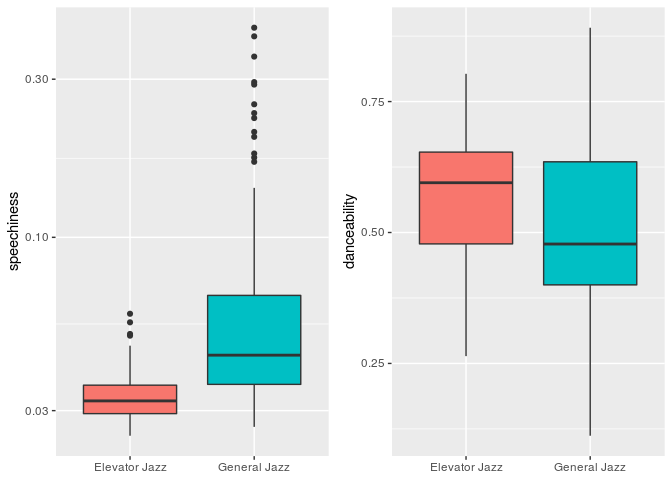

# Computational-Musicology-Portfolio
By Wim Pilkes

# The Corpus
When I am studying or just relaxing I often listen to Jazz. It can set a mood and is often good background music whilst focussing on other things. I have got two main spotify jazz lists I listen to.
One of the lists is an arbitrary mix of different Jazz songs I enjoy. The songs are from different sub-genres and were composed at different times. 
The other jazz list consists of more "toned-down" versions of popular jazz songs. There are no vocals and abrupt changes in the song feel less intense. I call this my "elevator music"-jazz list.

There is a slight overlap between the two lists. For example, the classic jazz song "Take five - The Dave Bruback Quartet" is part of general jazz list, whilst a different version "Take 5 - New York Jazz Lounge" is part of the elevator jazz list. These songs are extremely similar, yet sometimes I want to listen to the normal jazz list and sometimes to the elevator jazz list.

# Research ideas
This leads into multiple interesting things that can be researched:
How do these list differ from each other and why? Can this explain my decisions in when to listen to which playlist? What similarities can be found throughout the whole corpus?

# Exploring the two lists

After exploring the two lists, some notable differences and similarities were found. First of all, as predicted, the elevator jazz list has lower energy and a higher acousticness.

<!-- -->

<!-- -->

Secondly, it was found that the elevator jazz list has a lower speechiness. This is expected, because the list was designed to not contain any vocals. To the contrary the elevator jazz list has a higher danceability, this is unexpected because the list is mainly listened to when I am studying. This is also interesting because this list has a lower overal energy, yet a higher danceability. 

<!-- -->

